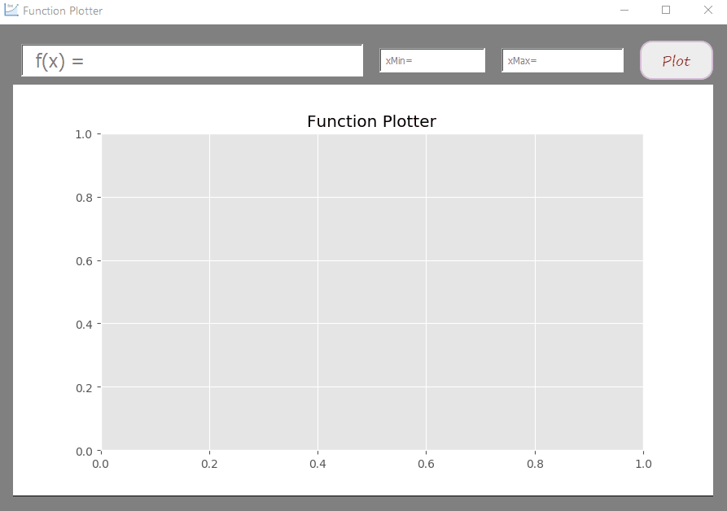
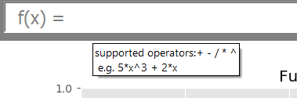
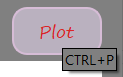
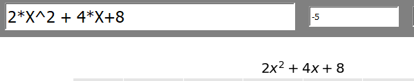
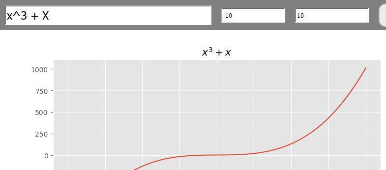

# Functions-Plotter

## Description
A 2D function plotter, which is based mainly on Pyside2 and Matplotlib, this utility  is able to plot univariate polynomials successfully.


## Installation
To install all the required dependencies, please run:
```python
 pip install -r requirements.txt
```
## Usage
* First it takes a function of X from the user.
* Then Takes min and max values of X.
* Applies input validation to the user input.


## Features:
* Tooltips for guidance



* Keyboard Shortcuts



* **ggplot** style theme

* Inline LaTeX rendered equation on the plot title


* Supports Upper and lower case ( X )


